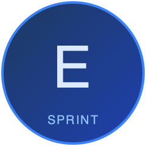
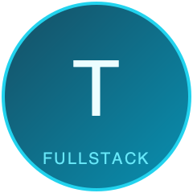

<div align="center">

# Execution-OS for Dev Teams

### Your AI Engineering Squad. Zero Config. Zero Dependencies.

**12 anime-named AI agents** that review your PRs, run browser tests, scan for vulnerabilities, scaffold projects, design UIs, track sprints, and write documentation — orchestrated by a single captain through natural conversation.

[](#the-squad)
[](#all-33-commands)
[](#native-skills)
[](LICENSE)

<br/>

<table>
<tr>
<td align="center"><br/><b>Wantan</b><br/><sub>Captain</sub></td>
<td align="center"><br/><b>Levi</b><br/><sub>Code Review</sub></td>
<td align="center"><br/><b>Killua</b><br/><sub>Testing</sub></td>
<td align="center"><br/><b>Itachi</b><br/><sub>Security</sub></td>
<td align="center"><br/><b>Shikamaru</b><br/><sub>DevOps</sub></td>
<td align="center"><br/><b>L</b><br/><sub>Docs</sub></td>
<td align="center"><br/><b>Erwin</b><br/><sub>Sprint</sub></td>
</tr>
<tr>
<td align="center"><br/><b>Hange</b><br/><sub>Research</sub></td>
<td align="center"><br/><b>Senku</b><br/><sub>Architect</sub></td>
<td align="center"><br/><b>Sai</b><br/><sub>Dashboard</sub></td>
<td align="center"><br/><b>Byakuya</b><br/><sub>Auditor</sub></td>
<td align="center"><br/><b>Tanjiro</b><br/><sub>Full-Stack</sub></td>
<td align="center"><br/><b>Ochaco</b><br/><sub>UI/Design</sub></td>
<td></td>
</tr>
</table>

</div>

---

## Why Execution-OS?

Most AI coding tools give you **one assistant that tries to do everything**. That's like having one person be your CTO, QA lead, security engineer, and designer simultaneously.

Execution-OS gives you a **team**.

| The Problem | Our Solution |
|------------|-------------|
| AI assistants lose context mid-task | **wantan-mem** persists memory across sessions with SQLite + vector search |
| AI generates code but nobody reviews it | **Levi** does 4-angle code review (architecture, bugs, security, readability) |
| Browser testing is always "we'll do it later" | **Killua** runs Playwright tests across Chromium/Firefox/WebKit on every deploy |
| Security scanning is a separate tool nobody checks | **Itachi** scans dependencies, SAST, secrets, and supply chain — integrated into the workflow |
| Sprint tracking lives in a different app | **Erwin** tracks velocity, runs standups, facilitates retros — all in your terminal |
| Scaffolding a new project takes hours of config | **Tanjiro** scaffolds 70+ project types (Next.js, Express, Expo, Flutter...) in minutes |
| AI-generated UIs all look the same | **Ochaco** enforces bold aesthetic direction — no more generic "AI slop" |
| Documentation is always outdated | **L** writes ADRs, runbooks, and postmortems automatically from code and incidents |

### What Makes This Different

**1. Specialized agents, not a generalist.** Each agent has a distinct personality, expertise, and constraints. Levi won't approve sloppy code. Itachi won't dismiss a critical CVE. Ochaco won't accept generic Inter-on-white designs.

**2. Quality gates built in.** Every agent output is validated (schema, references, math), gated for approval on external actions, and protected by circuit breakers. Bad AI output doesn't reach production.

**3. Zero external dependencies.** Every skill is reverse-engineered from best-in-class open source (Trail of Bits, AgentSys, cc-devops-skills, agnix, Anthropic frontend-design) and built natively. No API keys, no SaaS subscriptions, no vendor lock-in.

**4. Cross-session memory.** wantan-mem remembers what Levi flagged last week, what Killua's tests found yesterday, and what decisions you made last month. Your AI team builds institutional knowledge.

**5. Plugin + Template hybrid.** Your data stays yours (vault/). The AI layer auto-updates (plugin/). You own your sprint logs, decisions, and incidents. We push improved agents, skills, and commands.

---

## Use Cases

See real examples of Execution-OS in action:

| Use Case | What You'll Build |
|----------|------------------|
| [New Next.js Project](docs/use-cases/new-nextjs-project.md) | Full-stack SaaS with Prisma, Tailwind, JWT auth |
| [New Laravel Project](docs/use-cases/new-laravel-project.md) | E-commerce API with MySQL, Sanctum, Vue.js |
| [New Ionic + Capacitor](docs/use-cases/new-ionic-capacitor-project.md) | Cross-platform mobile app with native features |
| [New Expo React Native](docs/use-cases/new-expo-react-native-project.md) | Mobile app with NativeWind and Expo Router |
| [New Flutter Project](docs/use-cases/new-flutter-project.md) | Material 3 mobile app with Riverpod |
| [Add to Existing Project](docs/use-cases/add-to-existing-project.md) | Bolt on code review, testing, security to any codebase |
| [Handling Ideas & Requirements](docs/use-cases/handling-ideas-and-requirements.md) | From raw idea to shipped feature — the full lifecycle |
| [Using wantan-mem (Memory)](docs/use-cases/using-wantan-mem.md) | Cross-session memory: search past findings, track patterns, maintain knowledge |

---

## Quick Start

Open any project in Claude Code and install the plugin:

```bash
claude
```

```
/plugin marketplace add wantanwonderland/execution-os-devteam
/plugin install execution-os-devteam
/start
```

That's it. All 12 agents, 33 commands, and 51 skills are now available. Works in any project — new or existing.

### Optional: Add Vault Structure

For sprint tracking, incident management, decision logging, and the dashboard:

```bash
git clone --depth 1 https://github.com/wantanwonderland/execution-os-devteam.git /tmp/eos
cp -rn /tmp/eos/vault/* . && cp -rn /tmp/eos/vault/.* . 2>/dev/null
rm -rf /tmp/eos
bash setup-wizard.sh
sqlite3 data/company.db < data/schema.sql
```

---

## The Squad

<table>
<tr>
<td width="80" align="center"></td>
<td><b>Wantan</b> — <i>Captain & Orchestrator</i><br/>You talk to Wantan. Wantan delegates to the right specialist. Every request is routed, validated, and tracked. Think Jarvis — one interface, twelve specialists behind the scenes.</td>
</tr>
</table>

### Code Quality

<table>
<tr>
<td width="80" align="center"></td>
<td><b>Levi</b> — <i>Code Reviewer</i> (Attack on Titan)<br/>4-angle PR review: architecture drift, bugs, security surface, readability. Rates every PR on a cleanliness scale of 1-10. Starts every review with "Tch." when he finds something wrong.</td>
</tr>
<tr>
<td width="80" align="center"></td>
<td><b>Killua</b> — <i>Testing Specialist</i> (Hunter x Hunter)<br/>Unit, integration, E2E, browser, performance, visual regression, and accessibility testing. Runs Playwright across Chromium/Firefox/WebKit. Calls bugs "targets" and test runs "hunts."</td>
</tr>
<tr>
<td width="80" align="center"></td>
<td><b>Itachi</b> — <i>Security Guardian</i> (Naruto)<br/>Dependency audits, SAST, secrets detection, supply chain risk analysis. Classifies threats by ninja rank: S-rank (critical), A-rank (high), B-rank (medium), Genin-level (low).</td>
</tr>
</table>

### Build & Ship

<table>
<tr>
<td width="80" align="center"></td>
<td><b>Tanjiro</b> — <i>Full-Stack Developer</i> (Demon Slayer)<br/>Scaffolds 70+ project types (Next.js, Express, Expo, Flutter, Tauri...), builds components, designs databases, implements auth. Approaches every task with determination — never takes shortcuts.</td>
</tr>
<tr>
<td width="80" align="center"></td>
<td><b>Ochaco</b> — <i>UI/Design Engineer</i> (My Hero Academia)<br/>Bold aesthetic direction, OKLCH design tokens, responsive layouts, accessibility-first components. Fights against generic "AI slop" with distinctive typography, color, and motion. Rates designs on a "zero-gravity" scale.</td>
</tr>
<tr>
<td width="80" align="center"></td>
<td><b>Shikamaru</b> — <i>DevOps/Deployer</i> (Naruto)<br/>CI/CD monitoring, deploy tracking, rollback management, environment health. Thinks three moves ahead. Rates situations on a "drag scale" of 1-10.</td>
</tr>
</table>

### Knowledge & Process

<table>
<tr>
<td width="80" align="center"></td>
<td><b>L</b> — <i>Tech Writer</i> (Death Note)<br/>ADRs, runbooks, postmortems, changelogs, OpenAPI specs. Connects patterns nobody else sees. Never leaves a document without cross-references.</td>
</tr>
<tr>
<td width="80" align="center"></td>
<td><b>Erwin</b> — <i>Sprint Tracker</i> (Attack on Titan)<br/>Velocity tracking, ceremony facilitation, contribution scoring. Starts sprint reviews with "Dedicate your hearts!" Gets emotional about velocity improvements.</td>
</tr>
<tr>
<td width="80" align="center"></td>
<td><b>Hange</b> — <i>Researcher</i> (Attack on Titan)<br/>Tech evaluations, RFC prep, codebase orientation, deep research. Always includes a "Gaps" section — hates false completeness.</td>
</tr>
</table>

### System

<table>
<tr>
<td width="80" align="center"></td>
<td><b>Senku</b> — <i>System Architect</i> (Dr. Stone)<br/>Architecture decisions, tech debt tracking, agent creation. Builds from first principles. "Ten billion percent" confident in designs backed by data.</td>
</tr>
<tr>
<td width="80" align="center"></td>
<td><b>Sai</b> — <i>Dashboard Developer</i> (Naruto)<br/>Dev Performance Hub with 7 views. Pure HTML/CSS/JS + Chart.js. Turns data into visual clarity.</td>
</tr>
<tr>
<td width="80" align="center"></td>
<td><b>Byakuya</b> — <i>Vault Auditor</i> (Bleach)<br/>Read-only audits: frontmatter validation, agent linting, consistency checks. Assigns a Vault Health Score 0-100. The law is the law.</td>
</tr>
</table>

---

## Daily Workflow

```bash
# Morning
/today                    # Briefing: open PRs, failing CI, incidents, sprint progress
/standup                  # Set 3 priorities, review blockers

# Build
/new next.js              # Scaffold a project in minutes
/design                   # Get bold UI direction from Ochaco
/test unit                # Generate unit tests
/pr-queue                 # Check review SLA status
/security                 # Security scan dashboard

# Ship
/deploy                   # Deployment status
/incident P1 api "500s"   # Declare incident — auto-triages

# Improve
/sprint-review            # Velocity vs committed
/retro                    # Patterns, stop/start/continue
/debt                     # Tech debt inventory
```

---

## All 33 Commands

### Development

| Command | What It Does |
|---------|-------------|
| `/new` | Scaffold a project (Next.js, Express, Expo, Flutter, 70+ templates) |
| `/design` | UI design guidance (aesthetic direction, tokens, component design) |
| `/debug` | Debug with stack trace analysis, git history, and wantan-mem search |
| `/refactor` | Guided refactoring (Levi smells + Senku architecture) |
| `/migrate` | Database migration management (create, apply, rollback) |
| `/api` | OpenAPI spec generation, validation, breaking change detection |

### Testing & Security

| Command | What It Does |
|---------|-------------|
| `/test` | Full testing suite (unit, integration, E2E, browser, perf, visual, a11y) |
| `/security` | Security dashboard (CVEs, SAST, dependency health) |
| `/pr-queue` | Open PRs, review SLA status, blockers |

### Operations

| Command | What It Does |
|---------|-------------|
| `/deploy` | Deploy status, CI health, rollback history |
| `/incident` | Declare incident — auto-routes to triage + docs + tests |
| `/oncall` | On-call rotation management |

### Sprint & Team

| Command | What It Does |
|---------|-------------|
| `/today` | Morning briefing — PRs, CI, incidents, sprint progress |
| `/standup` | Daily standup — commitments, blockers, PR snapshot |
| `/standup-close` | End-of-day — score commitments |
| `/sprint-plan` | Sprint planning — velocity baseline, goal setting |
| `/sprint-review` | Sprint review — velocity vs committed |
| `/retro` | Retrospective — patterns, stop/start/continue |
| `/pulse` | Weekly dev metrics pulse |

### Knowledge

| Command | What It Does |
|---------|-------------|
| `/capture` | Quick-capture an idea |
| `/decide` | Log an architecture decision |
| `/onboard` | Generate codebase orientation for new devs |
| `/debt` | Tech debt inventory, add, resolve |
| `/ownership` | CODEOWNERS, bus factor, knowledge gaps |
| `/radar` | Tech radar (Adopt/Trial/Assess/Hold) |
| `/find` | Search the vault |
| `/inbox` | Review gated agent actions |

### System

| Command | What It Does |
|---------|-------------|
| `/status` | System dashboard |
| `/close` | Session close ritual |
| `/start` | First-run onboarding |
| `/newtask` | Create a task |
| `/calendar` | Calendar (requires Google Calendar MCP) |
| `/prep` | Meeting prep (requires Gmail + Calendar MCP) |

---

## Architecture

```
You ──> Wantan (orchestrator) ──> 12 Specialized Agents
                │                        │
                ├── wantan-mem           ├── GitHub (via gh CLI)
                │   (cross-session      ├── Playwright (browser tests)
                │    memory)            ├── SQLite DB (15 tables)
                │                       └── Vault (markdown files)
                └── Quality Gates
                    ├── Output validation (schema + refs + math)
                    ├── Human-in-the-loop (auto / review / blocked)
                    └── Circuit breaker (retry + backoff + cooldown)
```

### Quality Gates

Every agent dispatch goes through 3 layers:

1. **Validation** — Schema check, reference check (PR exists? CVE real?), math check (pass + fail = total?)
2. **Approval Gates** — Vault writes = auto. GitHub comments = review-required. Production deploys = blocked (needs CONFIRM)
3. **Circuit Breaker** — 3 retries with exponential backoff. Opens after 3+ failures. Cooldown 60s.

### Memory System (wantan-mem)

Cross-session memory with 3-layer progressive disclosure:

```
search("auth bug")          → 50-100 tokens/result (compact index)
timeline(anchor=42)         → chronological context around result
get_observations([42, 43])  → full details (~500-1000 tokens/result)
agent_query("levi", 7)      → "What has Levi flagged this week?"
```

### Dashboard

7-view Dev Performance Hub at `localhost:8080/dashboard/`:

Overview | Sprint | Pull Requests | Deployments | Testing | Security | System Health

---

## 51 Native Skills

All reverse-engineered from best-in-class open source. Zero external dependencies.

| Skill | Agent | Inspired By |
|-------|-------|-------------|
| `code-review` | Levi | [AgentSys](https://github.com/avifenesh/agentsys) |
| `security-scan` | Itachi | [Trail of Bits](https://github.com/trailofbits/skills) |
| `deploy-ops` | Shikamaru | [cc-devops-skills](https://github.com/akin-ozer/cc-devops-skills) |
| `agent-lint` | Byakuya | [agnix](https://github.com/agent-sh/agnix) |
| `frontend-design` | Ochaco | [Anthropic frontend-design](https://github.com/anthropics/claude-code) |
| `project-scaffold` | Tanjiro | [Scaffolding Skill](https://github.com/hmohamed01/Claude-Code-Scaffolding-Skill) |
| `react-patterns` | Tanjiro | [jezweb/claude-skills](https://github.com/jezweb/claude-skills) |
| `react-native-dev` | Tanjiro | [callstack agent-skills](https://github.com/callstackincubator/agent-skills) |
| `design-system` | Ochaco | [Frontend Design Toolkit](https://github.com/wilwaldon/Claude-Code-Frontend-Design-Toolkit) |
| `database-design` | Tanjiro | [alirezarezvani/claude-skills](https://github.com/alirezarezvani/claude-skills) |
| `auth-patterns` | Tanjiro | [alirezarezvani/claude-skills](https://github.com/alirezarezvani/claude-skills) |
| `fullstack-workflow` | Tanjiro | [shinpr/claude-code-workflows](https://github.com/shinpr/claude-code-workflows) |
| `browser-test` | Killua | Playwright MCP |
| `unit-test-gen` | Killua | Native |
| `integration-test` | Killua | Native |
| `perf-test` | Killua | Native |
| `visual-regression` | Killua | Native |
| `a11y-test` | Killua | Native |
| `quality-gates` | Wantan | Native |
| `incident-response` | Shikamaru + L | Native |
| `sprint-ceremonies` | Erwin | Native |
| `adr-writer` | L | Native |
| `runbook-writer` | L | Native |
| `api-spec` | L | Native |
| `tech-debt-tracker` | Senku | Native |
| `codebase-guide` | Hange | Native |
| `code-ownership` | Hange | Native |
| `tech-radar` | Hange | Native |
| + 23 more domain-agnostic skills | | |

---

## Works Everywhere

The plugin installs into Claude Code globally — use it in any project:

```bash
# New project
mkdir my-app && cd my-app && claude
/plugin marketplace add wantanwonderland/execution-os-devteam
/plugin install execution-os-devteam

# Existing project
cd /path/to/your-project && claude
/plugin marketplace add wantanwonderland/execution-os-devteam
/plugin install execution-os-devteam
```

Once installed, the plugin is available in every Claude Code session. No per-project setup needed.

---

## Token Efficiency

Designed to minimize cost:

- **Model tiering** — Opus for reasoning (Levi, Itachi, Tanjiro, Ochaco), Sonnet for procedural (Killua, Shikamaru, L, Erwin), Haiku for pattern matching (Byakuya)
- **Progressive loading** — Agent metadata (~200 tokens) at start, full prompts only on dispatch
- **Context isolation** — Each agent runs in a fresh subagent context
- **Smart compaction** — Checkpoints at 50%/65%/80% context fill
- **3-layer memory** — search (index) → timeline (context) → details (full)

---

## Repo Structure

```
execution-os-devteam/
├── .claude-plugin/           # Marketplace manifest
├── plugin/                   # AI LAYER (auto-updates)
│   ├── agents/        (12)   # The squad
│   ├── commands/      (33)   # Slash commands
│   ├── skills/        (51)   # Agent capabilities
│   ├── rules/         (16)   # System policies
│   ├── hooks/         (13)   # Automation
│   ├── mem/                  # wantan-mem (TypeScript)
│   └── settings.json         # Token efficiency defaults
├── vault/                    # TEMPLATE (user-owned)
│   ├── 00-identity/ ... 09-ops/
│   ├── data/                 # Schema + seed data
│   ├── dashboard/            # Dev Performance Hub
│   ├── CLAUDE.md             # System config
│   └── setup-wizard.sh       # Team personalization
├── assets/agents/            # Agent avatars
├── LICENSE                   # MIT
└── README.md
```

---

## Contributing

```bash
# Test locally
claude --plugin-dir ./plugin

# Agent definitions
plugin/agents/                 # Follow PKA Standard Template

# New commands
plugin/commands/               # Markdown with structured steps

# New skills
plugin/skills/{name}/SKILL.md  # Workflow instructions

# Bump version on release
plugin/.claude-plugin/plugin.json
```

---

<div align="center">

**Built for teams who ship.**

[Quick Start](#quick-start) | [Commands](#all-33-commands) | [The Squad](#the-squad) | [Architecture](#architecture)

MIT License

</div>
