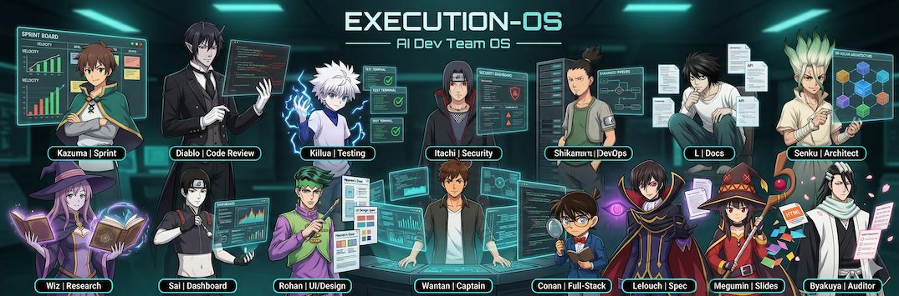
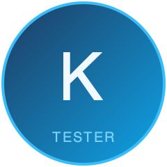
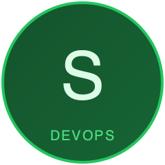

<div align="center">



# Execution-OS for Dev Teams

### Your AI Engineering Squad. Zero Config. Zero Dependencies.

**16 anime-named AI agents** that review your PRs, run browser tests, scan for vulnerabilities, scaffold projects, design UIs, generate HTML presentations, track sprints, query BigQuery, train ML models, and write documentation — orchestrated by a single captain through natural conversation.

[](#whats-new)
[](#the-squad)
[](#all-35-commands)
[](#native-skills)
[](LICENSE)

<br/>

<table>
<tr>
<td align="center"><br/><b>Wantan</b><br/><sub>Captain</sub></td>
<td align="center"><br/><b>Diablo</b><br/><sub>Code Review</sub></td>
<td align="center"><br/><b>Killua</b><br/><sub>Testing</sub></td>
<td align="center"><br/><b>Itachi</b><br/><sub>Security</sub></td>
<td align="center"><br/><b>Shikamaru</b><br/><sub>DevOps</sub></td>
<td align="center"><br/><b>L</b><br/><sub>Docs</sub></td>
<td align="center"><br/><b>Kazuma</b><br/><sub>Sprint</sub></td>
</tr>
<tr>
<td align="center"><br/><b>Wiz</b><br/><sub>Research</sub></td>
<td align="center"><br/><b>Senku</b><br/><sub>Architect</sub></td>
<td align="center"><br/><b>Sai</b><br/><sub>Dashboard</sub></td>
<td align="center"><br/><b>Byakuya</b><br/><sub>Auditor</sub></td>
<td align="center"><br/><b>Conan</b><br/><sub>Full-Stack</sub></td>
<td align="center"><br/><b>Rohan</b><br/><sub>UI/Design</sub></td>
<td align="center"><br/><b>Lelouch</b><br/><sub>Spec Strategist</sub></td>
<td align="center"><br/><b>Megumin</b><br/><sub>Slides</sub></td>
</tr>
<tr>
<td align="center"><br/><b>Yomi</b><br/><sub>BigQuery</sub></td>
<td align="center"><br/><b>Chiyo</b><br/><sub>ML Engineer</sub></td>
</tr>
</table>

</div>

---

## Why Execution-OS?

Most AI coding tools give you **one assistant that tries to do everything**. That's like having one person be your CTO, QA lead, security engineer, and designer simultaneously.

Execution-OS gives you a **team**.

| The Problem | Our Solution |
|------------|-------------|
| AI assistants lose context mid-task | **wantan-mem** persists memory across sessions with SQLite + vector search |
| AI generates code but nobody reviews it | **Diablo** does 4-angle code review (architecture, bugs, security, readability) — with anti-hallucination checks |
| AI code doesn't actually run | **Runtime verification gate** — build must succeed, dev server must boot, imports must resolve, all with actual stdout proof |
| Nobody knows if AI tests actually ran | **Killua** requires actual test runner output (stdout) in every report — no claims without proof |
| Browser testing is always "we'll do it later" | **Killua** runs Playwright tests across Chromium/Firefox/WebKit, including live browser testing |
| Security scanning is a separate tool nobody checks | **Itachi** scans dependencies, SAST, secrets, and supply chain — integrated into the pipeline |
| Sprint tracking lives in a different app | **Kazuma** tracks velocity, runs standups, facilitates retros — all in your terminal |
| Scaffolding a new project takes hours of config | **Conan** scaffolds 70+ project types (Next.js, Express, Expo, Flutter...) in minutes |
| AI-generated UIs all look the same | **Rohan** enforces bold aesthetic direction — no more generic "AI slop" |
| Documentation is always outdated | **L** writes ADRs, runbooks, and postmortems automatically from code and incidents |

### What Makes This Different

**1. Specialized agents, not a generalist.** Each agent has a distinct personality, expertise, and hard constraints. Diablo won't approve sloppy code. Itachi won't dismiss a critical CVE. Rohan won't accept generic Inter-on-white designs. Conan refuses to build without a spec and failing tests.

**2. Spec-Driven Development (SDD) pipeline.** Every feature flows through: Lelouch writes spec → Byakuya validates → Rohan designs + Killua writes failing tests + Conan starts backend (all parallel) → Conan implements → runtime verification gate → Diablo reviews → Itachi scans → Shikamaru deploys. No phase is skipped.

**3. Runtime verification — code must prove it works.** Before any review, the build must succeed, the dev server must boot, all imports must resolve to installed packages, and database migrations must run UP and DOWN — all with actual command output as proof. No claims without stdout/stderr evidence.

**4. Anti-hallucination enforcement.** Diablo cross-references every import against the dependency file and every API call against defined routes. Phantom imports and calls to nonexistent endpoints are rejected before they ship.

**5. Quality gates built in.** Every agent output is validated (schema, references, math), gated for approval on external actions, and protected by circuit breakers. Bad AI output doesn't reach production.

**6. Zero external dependencies.** Every skill is built natively, inspired by best-in-class open source projects. No API keys, no SaaS subscriptions, no vendor lock-in.

**7. Cross-session memory.** wantan-mem remembers what Diablo flagged last week, what Killua's tests found yesterday, and what decisions you made last month. Your AI team builds institutional knowledge.

**8. Plugin + Template hybrid.** Your data stays yours (vault/). The AI layer auto-updates (plugin/). You own your sprint logs, decisions, and incidents. We push improved agents, skills, and commands.

---

## Prerequisites

Before installing, make sure you have:

| Requirement | Version | Notes |
|-------------|---------|-------|
| [Claude Code](https://claude.ai/code) | Latest | CLI, desktop app, or IDE extension |
| Node.js | 20+ | Required for wantan-mem worker |
| pnpm | 9+ | `npm install -g pnpm` |
| [gh CLI](https://cli.github.com/) | Any | Optional — enables Diablo PR reviews, Shikamaru CI monitoring |
| Docker | Any | Optional — enables local container builds |

Verify Node.js and pnpm:

```bash
node --version   # should be v20+
pnpm --version   # should be 9+
```

---

## Quick Start

### 1. Install the plugin

Open any project in Claude Code and run:

```
/plugin marketplace add wantanwonderland/execution-os-devteam
/plugin install execution-os-devteam
/reload-plugins
```

### 2. Set up your project

```
/execution-os-devteam:start
```

This command:
- Creates `CLAUDE.md` in your project root with delegation rules and project config
- Sets up `.claude/` directory structure (tasks, team, owner-inbox)
- Prompts you to fill in your company name, project name, and tech stack
- Activates Wantan as your orchestrator for this project

### 3. Verify it's working

After setup, type a message to Wantan:

```
hey wantan, what can you do?
```

Wantan should introduce the squad and describe what each agent handles. If Wantan starts writing code directly instead of delegating, see [Troubleshooting](#troubleshooting).

### 4. Optional: Add vault structure

For sprint tracking, incident management, decision logging, and the performance dashboard:

```bash
git clone --depth 1 https://github.com/wantanwonderland/execution-os-devteam.git /tmp/eos
cp -rn /tmp/eos/vault/ ./vault/
rm -rf /tmp/eos
cd vault && bash setup-wizard.sh && cd ..
mv vault/CLAUDE.md ./CLAUDE.md
cp -rn vault/.claude/ ./.claude/ && rm -rf vault/.claude/
rm -f vault/README.md vault/INTEGRATIONS.md vault/install.sh vault/setup-wizard.sh
sqlite3 vault/data/company.db < vault/data/schema.sql
```

> **Important**: After setup, update the directory paths in `CLAUDE.md` to use `vault/` prefix (e.g., `08-inbox/` → `vault/08-inbox/`).

Or skip all manual steps — the `/execution-os-devteam:start` command handles everything automatically.

---

## How Delegation Works

Wantan is strictly an orchestrator. He never writes code, runs tests, or fixes bugs directly. Every request gets routed to the right specialist.

### Routing table

| You say... | Wantan routes to |
|------------|-----------------|
| "build X", "add feature", "create Y" | **Lelouch** (spec) → full SDD pipeline |
| "review this PR" | **Diablo** |
| "run tests", "write tests" | **Killua** |
| "scan for vulnerabilities" | **Itachi** |
| "deploy", "CI is broken", "fix Dockerfile" | **Shikamaru** |
| "write documentation", "ADR for X" | **L** |
| "sprint review", "velocity", "standup" | **Kazuma** |
| "research X", "evaluate Y vs Z" | **Wiz** |
| "design the UI", "aesthetic direction" | **Rohan** |
| "query BigQuery", "validate dashboard data", "data profiling" | **Yomi** |
| "train a model", "ML", "feature engineering", "EDA" | **Chiyo** |
| "system architecture", "hire new agent" | **Senku** |
| "project timeline", "Gantt chart", "roadmap", "system flow", "proposal deck" | **Lelouch** (stakeholder-docs skill) |

### What Wantan will NOT do directly

- Write, edit, or debug code
- Fix Dockerfiles or CI configs
- Run `git push` or create PRs
- Touch anything that belongs to a specialist

If you notice Wantan doing specialist work directly (writing code, editing files), your `CLAUDE.md` delegation rules need to be synced. See [Syncing delegation rules](#syncing-delegation-rules-to-existing-projects).

### Example: Requesting a feature

```
you: add user authentication to the API

wantan: Routing to Lelouch to write the spec first. Once you approve the spec,
        I'll kick off the full SDD pipeline: Rohan on design, Killua on tests,
        Conan on implementation — all in parallel.

lelouch: [writes spec with acceptance criteria, scope boundary, edge cases]

wantan: Lelouch's spec: [summary]. Does this capture what you meant?

you: yes, proceed

wantan: [dispatches Byakuya to validate, then parallel wave: Rohan + Killua + Conan]
```

### Example: Generating stakeholder documents

```
you: I need a Gantt chart and proposal deck for the new payment integration

wantan: Routing to Lelouch for stakeholder document generation.

lelouch: I'll use the stakeholder-docs skill. First, let me gather some details:
         - What's the target launch date?
         - What payment providers are in scope?
         - Who is the audience for the deck?

you: Stripe and PayPal. Launch by end of Q3. Deck is for the CTO.

lelouch: [generates project breakdown with epics, milestones, risks]
         Here's the breakdown — confirm before I render the documents?

you: looks good, proceed

lelouch: [renders Mermaid Gantt → PNG, system flow → PNG, proposal deck → PPTX]
         All documents saved to vault/02-docs/stakeholder/payment-integration/
```

**Accepted inputs:** PDFs (read natively), Word docs (via markitdown), PowerPoint files, images/whiteboard photos (read natively), meeting transcripts, Excel/CSV, or just a verbal description.

**Supported outputs:** Gantt charts, system flow diagrams, sequence diagrams, architecture diagrams (C4), ER diagrams, mindmaps, roadmaps, interactive timelines (Plotly HTML), executive briefs (DOCX), proposal decks (PPTX), project plan spreadsheets (XLSX).

**Rendering:** Mermaid diagrams via `mmdc` CLI (`npm install -g @mermaid-js/mermaid-cli`). Falls back to raw Mermaid code blocks (renderable on GitHub/GitLab/Notion) if `mmdc` is not installed.

See the full walkthrough with 7 scenarios: [Stakeholder Docs Use Case](docs/use-cases/stakeholder-docs.md)

---

## wantan-mem: Cross-Session Memory

wantan-mem is a persistent memory system that captures observations from every session and distills them into searchable facts. Your AI team remembers past decisions, bugs found, and architectural choices — even after the session ends.

### How it works

```
Session start  → Worker starts, past memory injected as context
User prompt    → Captured as observation (decisions, questions, requirements)
Tool use       → Captured (bash commands, agent dispatches, file edits)
Session end    → Turn summary written, session closed
```

Facts are distilled on write using importance scoring:
- `decision` (importance 10) — "decided to use JWT for auth"
- `error` (importance 8) — "build fails due to invalid Dockerfile syntax"
- `architecture` (importance 6) — "added Redis cache layer"
- `learned` (importance 3-4) — research, exploration, context

### Worker setup

The wantan-mem worker starts automatically via the `SessionStart` hook when Claude Code opens. If you need to start it manually:

```bash
cd /path/to/execution-os-devteam/plugin/mem
npm install       # first time only
npx tsx src/worker/server.ts
```

The worker runs on `http://localhost:37778`. The database lives at `~/.wantan-mem/wantan-mem.db` — it's shared across all projects.

### Memory dashboard

Open `vault/dashboard/index.html` in your browser (or run `python3 -m http.server 8080` from `vault/`) and click **Memory** in the sidebar.

The Memory tab shows:
- **Worker status** — live online/offline indicator with uptime
- **Stats** — total observations, distilled facts, sessions, DB size
- **Memory Index** — select a project to see the AI's summary of what it knows, with key facts ranked by importance
- **Fact categories** — breakdown across decision / architecture / error / security / pattern / learned
- **Fact search** — search by keyword, filter by category and project
- **Recent observations** — last 15 captured events

### Memory commands (in Claude Code)

```
wantan, what do you remember about auth?
wantan, what decisions did we make last week?
wantan, search memory for docker
```

Wantan queries wantan-mem directly and surfaces relevant facts from past sessions.

---

## Daily Workflow

```bash
# Morning
/today                    # Briefing: open PRs, failing CI, incidents, sprint progress
/standup                  # Set 3 priorities, review blockers

# Build
/new next.js              # Scaffold a project in minutes
/design                   # Get bold UI direction from Rohan
/test unit                # Generate unit tests
/pr-queue                 # Check review SLA status
/security                 # Security scan dashboard

# Ship
/deploy                   # Deployment status
/incident P1 api "500s"   # Declare incident — auto-triages

# Improve
/sprint-review            # Velocity vs committed
/retro                    # Patterns, stop/start/continue
/debt                     # Tech debt inventory
```

---

## Use Cases

See real examples of Execution-OS in action:

| Use Case | What You'll Build |
|----------|------------------|
| [New Next.js Project](docs/use-cases/new-nextjs-project.md) | Full-stack SaaS with Prisma, Tailwind, JWT auth |
| [New Laravel Project](docs/use-cases/new-laravel-project.md) | E-commerce API with MySQL, Sanctum, Vue.js |
| [New Ionic + Capacitor](docs/use-cases/new-ionic-capacitor-project.md) | Cross-platform mobile app with native features |
| [New Expo React Native](docs/use-cases/new-expo-react-native-project.md) | Mobile app with NativeWind and Expo Router |
| [New Flutter Project](docs/use-cases/new-flutter-project.md) | Material 3 mobile app with Riverpod |
| [Add to Existing Project](docs/use-cases/add-to-existing-project.md) | Bolt on code review, testing, security to any codebase |
| [Handling Ideas & Requirements](docs/use-cases/handling-ideas-and-requirements.md) | From raw idea to shipped feature — the full lifecycle |
| [Using wantan-mem (Memory)](docs/use-cases/using-wantan-mem.md) | Cross-session memory: search past findings, track patterns, maintain knowledge |

---

## The Squad

<table>
<tr>
<td width="80" align="center"></td>
<td><b>Wantan</b> — <i>Captain & Orchestrator</i><br/>You talk to Wantan. Wantan delegates to the right specialist. Every request is routed, validated, and tracked. Think Jarvis — one interface, twelve specialists behind the scenes.</td>
</tr>
</table>

### Code Quality

<table>
<tr>
<td width="80" align="center"></td>
<td><b>Diablo</b> — <i>Code Reviewer</i> (That Time I Got Reincarnated as a Slime)<br/>4-angle PR review: architecture drift, bugs, security surface, readability. Rates every PR on a purity scale of 1-10. Opens every review with "Kufufufu..." when he finds something wrong.</td>
</tr>
<tr>
<td width="80" align="center"></td>
<td><b>Killua</b> — <i>Testing Specialist</i> (Hunter x Hunter)<br/>Unit, integration, E2E, browser, performance, visual regression, and accessibility testing. Runs Playwright across Chromium/Firefox/WebKit. Calls bugs "targets" and test runs "hunts."</td>
</tr>
<tr>
<td width="80" align="center"></td>
<td><b>Itachi</b> — <i>Security Guardian</i> (Naruto)<br/>Dependency audits, SAST, secrets detection, supply chain risk analysis. Classifies threats by ninja rank: S-rank (critical), A-rank (high), B-rank (medium), Genin-level (low).</td>
</tr>
</table>

### Build & Ship

<table>
<tr>
<td width="80" align="center"></td>
<td><b>Conan</b> — <i>Full-Stack Developer</i> (Detective Conan)<br/>Scaffolds 70+ project types (Next.js, Express, Expo, Flutter, Tauri...), builds components, designs databases, implements auth. Investigates codebases like crime scenes — "There's only one truth!"</td>
</tr>
<tr>
<td width="80" align="center"></td>
<td><b>Rohan</b> — <i>UI/Design Engineer</i> (JoJo's Bizarre Adventure)<br/>Bold aesthetic direction, OKLCH design tokens, responsive layouts, accessibility-first components. Fights against generic "AI slop" with distinctive typography, color, and motion. Rates designs on a "manuscript quality" scale.</td>
</tr>
<tr>
<td width="80" align="center"></td>
<td><b>Megumin</b> — <i>HTML Slide Architect</i> (Konosuba)<br/>Self-contained HTML presentations powered by reveal.js, Tailwind, Chart.js, and Mermaid via CDN. One file, maximum visual impact. "EXPLOSION!"</td>
</tr>
<tr>
<td width="80" align="center"></td>
<td><b>Shikamaru</b> — <i>DevOps/Deployer</i> (Naruto)<br/>CI/CD monitoring, deploy tracking, rollback management, environment health, Dockerfile fixes. Monitors pipelines to completion — never declares success until CI reports green. Rates situations on a "drag scale" of 1-10.</td>
</tr>
</table>

### Knowledge & Process

<table>
<tr>
<td width="80" align="center"></td>
<td><b>L</b> — <i>Tech Writer</i> (Death Note)<br/>ADRs, runbooks, postmortems, changelogs, OpenAPI specs. Connects patterns nobody else sees. Never leaves a document without cross-references.</td>
</tr>
<tr>
<td width="80" align="center"></td>
<td><b>Kazuma</b> — <i>Sprint Tracker</i> (Konosuba)<br/>Velocity tracking, ceremony facilitation, contribution scoring. Keeps the chaotic party on mission with practical leadership. "Not bad for this party."</td>
</tr>
<tr>
<td width="80" align="center"></td>
<td><b>Wiz</b> — <i>Researcher</i> (Konosuba)<br/>Tech evaluations, RFC prep, codebase orientation, deep research. Always includes a "Gaps" section — hates false completeness. "I'm sorry, but the data shows..."</td>
</tr>
</table>

### Data & ML

<table>
<tr>
<td width="80" align="center"></td>
<td><b>Yomi</b> — <i>BigQuery Data Analyst</i> (Azumanga Daioh)<br/>Read-only BigQuery research: schema exploration, data profiling, dashboard validation, cross-table analysis, gap detection, anomaly detection. Always dry-runs before expensive queries. Never modifies data — only reads, analyzes, and reports.</td>
</tr>
<tr>
<td width="80" align="center"></td>
<td><b>Chiyo</b> — <i>Machine Learning Engineer</i> (Azumanga Daioh)<br/>Full ML lifecycle: EDA, feature engineering, model training, hyperparameter tuning, evaluation, and export. Enforces proper train/test splits, pipeline-based preprocessing, and comprehensive evaluation metrics. 10 hard rules prevent data leakage, overfitting, and cherry-picked metrics. Never deploys — that's Shikamaru's domain.</td>
</tr>
</table>

### Planning & Strategy

<table>
<tr>
<td width="80" align="center"></td>
<td><b>Lelouch</b> — <i>Spec Strategist</i> (Code Geass)<br/>PRD creation, acceptance criteria, scope boundaries, edge case analysis. Turns vague ideas into battle-ready specs. "The order has been given." Refuses ambiguity — every requirement gets interrogated until concrete.</td>
</tr>
</table>

### System

<table>
<tr>
<td width="80" align="center"></td>
<td><b>Senku</b> — <i>System Architect</i> (Dr. Stone)<br/>Architecture decisions, tech debt tracking, agent creation. Builds from first principles. "Ten billion percent" confident in designs backed by data.</td>
</tr>
<tr>
<td width="80" align="center"></td>
<td><b>Sai</b> — <i>Dashboard Developer</i> (Naruto)<br/>Dev Performance Hub with 8 views (Overview, Sprint, PRs, Deployments, Testing, Security, System Health, Memory). Pure HTML/CSS/JS + Chart.js. Turns data into visual clarity.</td>
</tr>
<tr>
<td width="80" align="center"></td>
<td><b>Byakuya</b> — <i>Vault Auditor</i> (Bleach)<br/>Read-only audits: frontmatter validation, agent linting, consistency checks. Assigns a Vault Health Score 0-100. The law is the law.</td>
</tr>
</table>

---

## All 33 Commands

### Development

| Command | What It Does |
|---------|-------------|
| `/new` | Scaffold a project (Next.js, Express, Expo, Flutter, 70+ templates) |
| `/design` | UI design guidance (aesthetic direction, tokens, component design) |
| `/debug` | Debug with stack trace analysis, git history, and wantan-mem search |
| `/refactor` | Guided refactoring (Diablo smells + Senku architecture) |
| `/migrate` | Database migration management (create, apply, rollback) |
| `/api` | OpenAPI spec generation, validation, breaking change detection |

### Testing & Security

| Command | What It Does |
|---------|-------------|
| `/test` | Full testing suite (unit, integration, E2E, browser, perf, visual, a11y) |
| `/security` | Security dashboard (CVEs, SAST, dependency health) |
| `/pr-queue` | Open PRs, review SLA status, blockers |

### Operations

| Command | What It Does |
|---------|-------------|
| `/deploy` | Deploy status, CI health, rollback history |
| `/incident` | Declare incident — auto-routes to triage + docs + tests |
| `/oncall` | On-call rotation management |

### Sprint & Team

| Command | What It Does |
|---------|-------------|
| `/today` | Morning briefing — PRs, CI, incidents, sprint progress |
| `/standup` | Daily standup — commitments, blockers, PR snapshot |
| `/standup-close` | End-of-day — score commitments |
| `/sprint-plan` | Sprint planning — velocity baseline, goal setting |
| `/sprint-review` | Sprint review — velocity vs committed |
| `/retro` | Retrospective — patterns, stop/start/continue |
| `/pulse` | Weekly dev metrics pulse |

### Knowledge

| Command | What It Does |
|---------|-------------|
| `/capture` | Quick-capture an idea |
| `/decide` | Log an architecture decision |
| `/onboard` | Generate codebase orientation for new devs |
| `/debt` | Tech debt inventory, add, resolve |
| `/ownership` | CODEOWNERS, bus factor, knowledge gaps |
| `/radar` | Tech radar (Adopt/Trial/Assess/Hold) |
| `/find` | Search the vault |
| `/inbox` | Review gated agent actions |

### System

| Command | What It Does |
|---------|-------------|
| `/status` | System dashboard |
| `/cost-report` | Token usage and cost breakdown (current session, today, or all) |
| `/close` | Session close ritual |
| `/newtask` | Create a task |
| `/calendar` | Calendar (requires Google Calendar MCP) |
| `/prep` | Meeting prep (requires Gmail + Calendar MCP) |

---

## Architecture

```
You ──> Wantan (orchestrator) ──> 15 Specialized Agents
                │                        │
                ├── wantan-mem           ├── GitHub (via gh CLI)
                │   (cross-session      ├── Playwright (browser tests)
                │    memory)            ├── SQLite DB (15 tables)
                │                       └── Vault (markdown files)
                ├── Context Bus
                │   (.claude/context/)   Structured handoffs between phases
                │                        200-500 tokens vs 5-20K raw output
                └── Quality Gates
                    ├── Output validation (schema + refs + math)
                    ├── Human-in-the-loop (auto / review / blocked)
                    ├── Circuit breaker (retry + backoff + cooldown)
                    └── Cost optimization (SendMessage, Haiku routing, dispatch tiers)
```

### Quality Gates

Every feature and agent dispatch goes through 4 layers:

**Layer 0: SDD Phase Gates (Hook-Enforced)**
Spec must exist and be user-approved (Lelouch self-validates, Byakuya as fallback) → Wiz researches competitors (if UI) → Rohan + Killua + Conan backend + Itachi security all run in parallel → runtime verification gate (build ✓, imports ✓, server boot ✓, migrations ✓) → Diablo review (max 2 rounds, fixes via SendMessage) → security gate check → L writes docs → user confirms deploy → staging smoke tests → production.

Pipeline state tracked in `.claude/sdd-state.json`. `sdd-gate.sh` (PreToolUse hook) **structurally blocks** premature Agent dispatches — Conan frontend cannot start until Rohan delivers, deploys cannot start until Diablo reviews. Exit code 2 = hard block, not a suggestion.

**Layer 1: Output Validation**
Schema check (required fields present), reference check (PR exists? CVE real? file paths valid?), math check (pass + fail = total? counts match runner output?). Every agent claim must have actual command output as proof — no assertions without stdout/stderr evidence.

**Layer 2: Approval Gates**
Vault writes = auto. GitHub comments = review-required. Production deploys = blocked (needs CONFIRM).

**Layer 3: Circuit Breaker**
3 retries with exponential backoff. Opens after 3+ failures. Cooldown 60s.

### Agent Behavioral Guarantees

Every agent has hard constraints that cannot be bypassed:

| Agent | Key Constraint |
|-------|---------------|
| Wantan | Never self-executes specialist work — orchestrate only (talk, route, validate, summarize) |
| Wantan | Never uses utility agents as substitute for squad members on feature work |
| Conan | Always creates a branch + PR — never pushes directly to main |
| Conan | Classifies every fix as Permanent/Temporary/Workaround — no throwaway fixes without persistence plan |
| Conan | Verifies design compliance after UI implementation — colors, fonts, responsive must match Rohan's spec |
| Rohan | Refuses to design without Wiz's competitor research — no designing in a vacuum |
| Rohan | Dual-audience output mandatory — Experience Summary (business) + Conan Handoff (technical) |
| Wiz | Researches 3-5 competitors before Rohan designs (Phase 1.75) |
| Shikamaru | Monitors CI to terminal state — never declares success on `in_progress` |
| Shikamaru | Classifies every fix as Permanent/Temporary/Workaround |
| Killua | Reports full test matrix — no cherry-picked passes, no partial suites |
| Diablo | Never approves without actual build output + passing test output as proof |
| Yomi | Read-only — never creates, modifies, or deletes any BigQuery resource |
| Chiyo | Never deploys models — trains, evaluates, exports only. Never preprocesses outside Pipeline. |

### Memory System (wantan-mem)

Persistent cross-session memory that captures everything — your decisions, research, tool results, and session context. Inspired by [SimpleMem](https://github.com/aiming-lab/SimpleMem), [Mem0](https://github.com/mem0ai/mem0), [memsearch](https://github.com/zilliztech/memsearch), [Memori](https://github.com/MemoriLabs/Memori), and [claude-mem](https://github.com/thedotmack/claude-mem).

**7-Hook Pipeline:**

```
SessionStart  → Start worker, inject past memory as context
UserPrompt    → Capture your decisions, requirements, questions
PreToolUse    → SDD gate (block premature Agent dispatches) + env/secret guards
PostToolUse   → Capture tool results + auto-update SDD state on agent completion
Stop          → Generate turn summary (files changed, searches, actions)
PreCompact    → Backup context before compression
SessionEnd    → Close session
```

**Fact Extraction (compress on write):**

Every observation is automatically distilled into facts with importance scoring:
- Decisions ("use JWT for auth") → importance 10
- Errors/bugs found → importance 8
- Architecture changes → importance 6
- Research/exploration → importance 4
- Noise (ls, git status, slash commands, casual chat) → filtered out

**3-Tier Retrieval:**

```
mem_index("my-project")    → L1 always-loaded summary (~500 tokens)
mem_facts("auth decision") → search distilled facts by category/importance
mem_categories()           → list what's stored (decision, architecture, error...)
search("auth bug")         → raw observation search (fallback)
```

**Zero external dependencies.** SQLite + FTS5 only. No ChromaDB, no vector DB, no Python backend.

### Dashboard

8-view Dev Performance Hub at `localhost:8080/dashboard/`:

Overview | Sprint | Pull Requests | Deployments | Testing | Security | System Health | **Memory**

Open it: `python3 -m http.server 8080` from the `vault/` directory.

---

## 55 Native Skills

All built natively, inspired by best-in-class open source. Zero external dependencies.

| Skill | Agent | Inspired By |
|-------|-------|-------------|
| `code-review` | Diablo | [AgentSys](https://github.com/avifenesh/agentsys) |
| `security-scan` | Itachi | [Trail of Bits](https://github.com/trailofbits/skills) |
| `deploy-ops` | Shikamaru | [cc-devops-skills](https://github.com/akin-ozer/cc-devops-skills) |
| `agent-lint` | Byakuya | [agnix](https://github.com/agent-sh/agnix) |
| `frontend-design` | Rohan | [Anthropic frontend-design](https://github.com/anthropics/claude-code) |
| `project-scaffold` | Conan | [Scaffolding Skill](https://github.com/hmohamed01/Claude-Code-Scaffolding-Skill) |
| `react-patterns` | Conan | [jezweb/claude-skills](https://github.com/jezweb/claude-skills) |
| `react-native-dev` | Conan | [callstack agent-skills](https://github.com/callstackincubator/agent-skills) |
| `design-system` | Rohan | [Frontend Design Toolkit](https://github.com/wilwaldon/Claude-Code-Frontend-Design-Toolkit) |
| `database-design` | Conan | [alirezarezvani/claude-skills](https://github.com/alirezarezvani/claude-skills) |
| `auth-patterns` | Conan | [alirezarezvani/claude-skills](https://github.com/alirezarezvani/claude-skills) |
| `fullstack-workflow` | Conan | [shinpr/claude-code-workflows](https://github.com/shinpr/claude-code-workflows) |
| `browser-test` | Killua | Playwright MCP |
| `unit-test-gen` | Killua | Native |
| `integration-test` | Killua | Native |
| `perf-test` | Killua | Native |
| `visual-regression` | Killua | Native |
| `a11y-test` | Killua | Native |
| `quality-gates` | Wantan | Native |
| `incident-response` | Shikamaru + L | Native |
| `sprint-ceremonies` | Kazuma | Native |
| `adr-writer` | L | Native |
| `runbook-writer` | L | Native |
| `api-spec` | L | Native |
| `tech-debt-tracker` | Senku | Native |
| `codebase-guide` | Wiz | Native |
| `code-ownership` | Wiz | Native |
| `tech-radar` | Wiz | Native |
| `live-browser-test` | Killua | Native |
| `roleplay-scenario` | Killua | Native |
| `stakeholder-docs` | Lelouch | [presenton](https://github.com/presenton/presenton), [MARAS](https://github.com/Shivathanu/requirements-analysis-system) |
| + 23 more domain-agnostic skills | | |

---

## Works Everywhere

The plugin installs into Claude Code globally — use it in any project:

```bash
# New project
mkdir my-app && cd my-app && claude
/plugin marketplace add wantanwonderland/execution-os-devteam
/plugin install execution-os-devteam
/reload-plugins
/execution-os-devteam:start

# Existing project
cd /path/to/your-project && claude
/plugin marketplace add wantanwonderland/execution-os-devteam
/plugin install execution-os-devteam
/reload-plugins
/execution-os-devteam:start
```

Once installed, the plugin is available in every Claude Code session. No per-project setup needed.

---

## Updating the Plugin

The plugin auto-updates when the marketplace is refreshed. To manually update:

```
/plugin marketplace update
```

If you're stuck on an old version:

```
/plugin uninstall execution-os-devteam
/plugin install execution-os-devteam
```

Check your installed version:

```
/plugin list
```

### Migrating existing projects to v1.4.0

The `migrate.py` script handles everything: CLAUDE.md delegation sync, database schema upgrades, credential scrubbing, noise pruning, vault manifest generation, and context bus setup.

**Migrate all installed projects:**

```bash
# From the execution-os-devteam repo root
python3 migrate.py                  # dry run — shows what would change
python3 migrate.py --apply          # apply to all installed projects
```

**Migrate a single project:**

```bash
python3 migrate.py --apply --path /path/to/your-project
```

**Database-only or vault-only:**

```bash
python3 migrate.py --apply --db-only     # only database migrations
python3 migrate.py --apply --vault-only   # only vault + CLAUDE.md
```

**What the migration does:**

| Step | What | Why |
|------|------|-----|
| Create `episodes` table | Episode memory for "I solved this before" | New in v1.4.0 |
| Scrub credentials | Strip passwords/tokens from existing observations + facts | Security fix |
| Prune noise | Delete git status, ls, cat observations | 24% of DB was noise |
| Clean worktrees | Delete orphaned agent-* project data | 13.6% of DB was ephemeral waste |
| Drop dead tables | Remove pr_observations, test_observations, security_observations (0 rows) | Schema cleanup |
| Rebuild L1 indexes | Apply new quality filters (importance >= 5) | Better memory summaries |
| Sync CLAUDE.md | Update delegation block with new pipeline (v1.3.0+) | New agents, dispatch tiers, SendMessage rules |
| Generate MANIFEST.md | Pre-computed vault document index | 6-12x cheaper vault lookups |
| Create .claude/context/ | Context bus directory for structured handoffs | New in v1.3.0 |

**After migration:**
1. Restart wantan-mem worker: `cd plugin/mem && npx tsx src/worker/server.ts`
2. Reload plugins in Claude Code: `/reload-plugins`
3. Verify: `wantan, check memory health`

### Syncing delegation rules only (legacy)

If you only need to sync the CLAUDE.md delegation block without running the full migration:

```bash
# From the execution-os-devteam repo root
python3 sync-delegation.py          # dry run — shows what would change
python3 sync-delegation.py --apply  # apply to all installed projects
```

**Sync a single project:**

```bash
python3 sync-delegation.py --apply --path /path/to/your-project
```

The script patches only the delegation block, leaving all project-specific content (tech stack, modules, code conventions) untouched.

**When to sync or migrate:**
- After any Execution-OS update that changes agent routing or SDD pipeline rules
- When Wantan stops delegating correctly in a project
- After adding a new agent to the squad
- After upgrading to v1.3.0+ (pipeline changes) or v1.4.0+ (memory changes) — use `migrate.py` instead

---

## Troubleshooting

### Wantan writes code directly instead of delegating

Your project's `CLAUDE.md` is missing or has outdated delegation rules.

**Fix:**
```bash
# From execution-os-devteam repo root
python3 sync-delegation.py --apply --path /path/to/your-project
```

Or run `/execution-os-devteam:start` in the project to regenerate `CLAUDE.md` from scratch.

### Memory tab shows "worker offline"

The wantan-mem worker isn't running.

**Fix — start it manually:**
```bash
cd /path/to/execution-os-devteam/plugin/mem
npm install       # only needed once after install/update
npx tsx src/worker/server.ts
```

Or restart Claude Code — the `SessionStart` hook starts the worker automatically.

**Check the worker log:**
```bash
cat /tmp/wantan-mem.log
```

### Memory tab shows stale or incorrect data

The memory index for a project may be out of date.

**Fix — rebuild the index:**
```bash
curl -s -X POST http://localhost:37778/api/facts/rebuild-index \
  -H "Content-Type: application/json" \
  -d '{"project": "your-project-name"}'
```

Or click **Refresh** in the Memory tab of the dashboard.

### Agents bypass quality gates (e.g. Conan pushes to main)

Each agent's gate rules are in `plugin/agents/<name>.md`. If an agent bypasses constraints, the rules may need to be reinforced in the agent dispatch prompt.

**Check the agent file:**
```bash
cat plugin/agents/conan.md   # look for "Branch & PR Discipline"
cat plugin/agents/shikamaru.md # look for "Pipeline Monitoring"
```

### Dashboard doesn't load data

Make sure the SQLite database is initialized:
```bash
cd vault
sqlite3 data/company.db < data/schema.sql
```

Then open `vault/dashboard/index.html` directly in a browser, or via:
```bash
python3 -m http.server 8080   # then open http://localhost:8080/dashboard/
```

### CI/CD deploy hook not triggering

Make sure `.claude/settings.local.json` has the plugin enabled:
```json
{
  "plugins": {
    "execution-os-devteam@execution-os-devteam": true
  }
}
```

---

## Token Efficiency

Designed to minimize cost:

- **Model tiering** — Each agent has a recommended model tier (Opus for reasoning, Sonnet for procedural, Haiku for pattern matching), but your global model selection is always respected. Agents inherit your session model — no forced overrides.
- **Progressive loading** — Agent metadata (~200 tokens) at start, full prompts only on dispatch
- **Context isolation** — Each agent runs in a fresh subagent context
- **Smart compaction** — Checkpoints at 50%/65%/80% context fill
- **3-layer memory** — search (index) → timeline (context) → details (full)
- **Cost tracking** — `/cost-report` shows per-session, daily, and all-time token usage with cost breakdown by model

---

## Repo Structure

```
execution-os-devteam/
├── .claude-plugin/           # Marketplace manifest
├── plugin/                   # AI LAYER (auto-updates)
│   ├── agents/        (15)   # The squad
│   ├── commands/      (33)   # Slash commands
│   ├── skills/        (55)   # Agent capabilities
│   ├── rules/         (17)   # System policies
│   ├── hooks/         (15)   # Automation (incl. SDD gate + state update)
│   ├── mem/                  # wantan-mem (TypeScript worker + SQLite)
│   └── settings.json         # Token efficiency defaults
├── vault/                    # TEMPLATE (user-owned)
│   ├── 00-identity/ ... 09-ops/
│   ├── data/                 # Schema + seed data
│   ├── dashboard/            # Dev Performance Hub (8 views)
│   ├── CLAUDE.md             # System config (with delegation rules)
│   └── setup-wizard.sh       # Team personalization
├── migrate.py                # Full migration for existing projects (v1.4.0+)
├── sync-delegation.py        # Sync delegation rules only (legacy)
├── assets/agents/            # Agent avatars
├── LICENSE                   # MIT
└── README.md
```

---

## What's New

### v1.4.0

**Memory architecture overhaul — additional 30-50% cost reduction through smarter memory.**

- **Credential scrubbing** — Passwords, tokens, API keys, and connection strings are now stripped from observations before storage. Regex patterns catch SSH passwords, database URIs, bearer tokens, AWS/GCP/Azure keys, and generic PASSWORD/SECRET env vars. 281 existing facts with plaintext credentials are a known issue in pre-1.4.0 databases.
- **Bash noise filter hardened** — Observe hook now filters git status/log/diff, ls, cat, grep, sed, head/tail, version checks, docker ps/logs, and localhost curl at the shell level. Previously 24% of observations (1,335 of 5,484) were pure noise that leaked through to the database.
- **Fact classification overhaul** — Tightened greedy regex rules: `Write:` and `Edit:` no longer auto-classify as architecture (importance 6). Security category requires actual CVE/vulnerability findings, not project names containing "security". Turn summaries filtered as noise. Result: useful facts (decisions, blockers, patterns) should rise from 0.7% to ~15-20% of all facts.
- **L1 index quality** — `rebuildIndex()` now filters to importance >= 5 and excludes Bash/Write/Edit/Agent prefixes. Memory summaries show actual decisions and findings instead of reformulated bash commands.
- **Agent-scoped memory retrieval** — New `agent_scope` parameter on `mem_facts`. Each agent retrieves only fact categories relevant to their role (e.g., Conan gets architecture+error, Itachi gets security only). Research shows 60-70% per-agent token reduction.
- **Episode memory** — New `episodes` table and `episode_search`/`episode_store` MCP tools. Agents check "have I solved this before?" before starting work. Only verified successes are stored (MemP research: naive add-all is worse than no memory). Expected 18% step reduction on recurring tasks.
- **Observation pruning wired up** — Compact hook now calls `prune()` (14-day cutoff, creates weekly digests) and cleans up orphaned worktree project data. Previously observations accumulated forever.
- **Vault manifest index** — New `vault/MANIFEST.md` system provides a pre-computed document inventory (~2K tokens) that agents read before grepping vault directories (~85K tokens). 6-12x reduction in vault retrieval cost.

### v1.3.0

**Pipeline cost optimization — 35-60% reduction in daily subagent costs.** Research-backed changes from multi-agent cost analysis (OrgAgent, Google ADK, LangGraph, Mastra, AgentDiet).

- **Agent continuation via SendMessage** — Fix loops in Phases 3.5 and 4 now continue existing agents instead of spawning fresh dispatches. A fresh dispatch loads ~45-65K tokens of context; SendMessage costs ~500 tokens. 100x cheaper per fix cycle.
- **Structured context handoffs** — Phase transitions pass 200-500 token structured summaries instead of 5-20K token raw agent output. Handoff templates defined for every phase boundary.
- **Context bus (`.claude/context/`)** — Agents write structured deliverables to shared files. Downstream agents read only what they need instead of receiving everything through Wantan's prompt.
- **3-tier dispatch path** — Full SDD (14-31 dispatches) for features, Light SDD (3-5 dispatches) for bug fixes, Direct (1 dispatch) for single-file changes. Not every task needs the full pipeline.
- **Haiku model routing** — Byakuya, L, and Kazuma dispatch on Haiku (3x cheaper than Sonnet) for checklist/pattern-matching work.
- **Merged sequential agents** — Byakuya validation merged into Lelouch (1 fewer dispatch). L docs moved to Phase 5 only (1 fewer dispatch). Itachi scans in Phase 2 parallel (catches security issues earlier, reduces late-stage fix cycles).
- **Fix loop caps** — Phase 3.5: max 5 cycles with early-out on >5 first-pass failures. Phase 4: max 2 CHANGES_REQUESTED rounds before user escalation.
- **Tool result truncation** — Bash output capped at 3K tokens, Grep at 50 matches, agent returns at 2K tokens. Reduces token waste from verbose outputs.

### v1.2.0

**Two new Azumanga Daioh agents: BigQuery + Machine Learning.**

- **Yomi — BigQuery Data Analyst** — Read-only BQ research agent. Schema exploration, data profiling, dashboard validation, cross-table analysis, time-series gap detection, anomaly detection. Mandatory project context check before querying. Cost-conscious: dry-runs first, `--maximum_bytes_billed` on every query. Never modifies data.
- **Chiyo — Machine Learning Engineer** — Full ML lifecycle agent. EDA, feature engineering, model training (scikit-learn, XGBoost, LightGBM, CatBoost), hyperparameter tuning (Optuna), evaluation, SHAP explainability, model export (joblib/ONNX). 10 hard anti-pattern rules prevent data leakage, training on test data, and cherry-picked metrics. Coordinates with Yomi for BigQuery data access.
- **Agent count**: 14 → 16
- **Gate policy**: Added 16 new gate rules for Yomi (6, all Auto) and Chiyo (10, mixed Auto/Review-required/Blocked)
- **Routing tables**: Updated in wantan.md, vault/CLAUDE.md, and roster.md

### v1.1.7

- **Fix FTS5 multi-word query failure** — `mem_facts` and `search` now convert multi-word queries to OR terms (e.g., `login auth method` → `login OR auth OR method`). Previously, multi-word queries required ALL words in a single fact, returning "No facts found" for queries like "login auth authentication method" even when individual words matched.

### v1.1.6

- **Flexible builder assignment in visual checklist** — Checklist now enforces prerequisites (research + design) but lets the user pick which agent builds. Conan, Megumin, and Sai can all produce HTML — user chooses the builder, Wantan only ensures Rohan's design direction exists first.

### v1.1.5

- **Visual artifact pre-dispatch checklist** — Wantan now runs a structured checklist before dispatching any visual agent: Wiz research → Rohan design → builder agent. Each step blocks until previous completes. Even when the user directly requests a specific agent, Wantan checks prerequisites first.

### v1.1.4

- **Megumin slides.md gate enforced** — Step 4 (RENDER HTML) now hard-gates on `slides.md` existing. Megumin cannot skip to HTML generation without writing the markdown source first. Core principle strengthened with "No exceptions" language.

### v1.1.3

- **Megumin blocked by Rohan** — Megumin now requires Rohan's design direction (colors, fonts, aesthetic tone) before building slide decks. Added to routing table with Rohan dependency and Step 0 validation in Megumin's agent definition. All visual artifact agents (Megumin, Sai, Conan frontend) must wait for Rohan.

### v1.1.2

- **Wiz owns `vault/03-research/`** — Routing table now explicitly routes research file updates to Wiz, not L. Prevents L from taking over research file edits that belong to Wiz's domain.

### v1.1.1

- **Wiz gains Write tool** — Wiz can now persist research output directly to `vault/03-research/` as markdown. Previously Wiz was read-only and couldn't fulfill the .md-first research rule without routing through L.

### v1.1.0

**Memory retrieval fixes and research workflow enforcement.**

- **Research .md-first rule** — Wiz now MUST save research to `vault/03-research/` as markdown with frontmatter before passing to downstream agents or generating artifacts (slides, proposals). Rohan rejects inline-only briefings without a vault file.
- **Research artifact quality gate** — New gate (step 5.5) validates research .md file exists before Phase 2 dispatch. No more orphaned slide decks without searchable source docs.
- **wantan-mem L1 index auto-rebuild** — Memory index now rebuilds automatically every 10 facts and on session end. Previously required manual `POST /api/facts/rebuild-index` and was always empty.
- **Session-start memory injection** — Session start hook now queries wantan-mem and injects L1 summary + high-priority facts as context via stdout. Previous sessions' work is now surfaced automatically.
- **Recency decay in fact ranking** — Index ranking now uses `score = importance * access_boost * 0.995^hours` (half-life ~6 days). Stale facts naturally drop out of the L1 summary.
- **MCP server callWorker fix** — `fetch()` now passes the options object (method, headers, body were silently discarded).
- **JSON escaping in observe hook** — Content and project name now properly escaped via `json.dumps()`, preventing silent data loss on special characters.
- **Checkpoint hook** — PreCompact hook now triggers L1 index rebuild before compaction (was a no-op).
- **Vault retrieval wantan-mem integration** — Vault retrieval now queries wantan-mem in parallel with local search for all query types, not just "historical pattern" queries.
- **`/today` Memory Synthesis** — Step 14 now uses correct MCP tool names (`mem_index`, `mem_facts`) instead of non-existent `smart_search`.

### v1.0.0
- **14 anime agents at launch** — Wantan (Captain), Diablo (Code Review), Killua (Testing), Itachi (Security), Shikamaru (DevOps), L (Docs), Kazuma (Sprint), Wiz (Research), Senku (Architect), Sai (Dashboard), Byakuya (Auditor), Conan (Full-Stack), Rohan (UI/Design), Lelouch (Spec), Megumin (Slides)
- **Spec-Driven Development pipeline** — Lelouch spec → Byakuya validation → Rohan design + Killua tests (parallel) → Conan implementation → Diablo review → Shikamaru deploy. Structural enforcement via hooks.
- **Markdown-first html-slides** — Megumin writes `slides.md` (canonical source), renders to HTML via reveal.js + Tailwind + Chart.js + Mermaid CDN stack. Re-renderable to PPTX or PDF.
- **Stakeholder docs skill** — Gantt charts, system flows, sequence diagrams, architecture diagrams, roadmaps, interactive timelines, executive briefs, proposal decks, project plan spreadsheets.
- **Anti-hallucination enforcement** — Phantom import detection, runtime verification gates (build output, test output, server boot log as proof), API endpoint validation.
- **wantan-mem** — Cross-session SQLite memory with fact extraction, vector search, MCP server, memory dashboard.
- **56 native skills** — No external API keys, no SaaS dependencies. Everything built in.
- **Competitor research pipeline** — Wiz analyzes competitors before Rohan designs. Dual-audience output (stakeholder + developer).
- **Solution quality gates** — Permanent/Temporary/Workaround classification. Branch + PR discipline enforced.

---

## Contributing

```bash
# Test locally
claude --plugin-dir ./plugin

# Agent definitions
plugin/agents/                 # Follow PKA Standard Template

# New commands
plugin/commands/               # Markdown with structured steps

# New skills
plugin/skills/{name}/SKILL.md  # Workflow instructions

# Bump version on release
plugin/.claude-plugin/plugin.json
```

---

<div align="center">

**Built for teams who ship.**

[Quick Start](#quick-start) | [Commands](#all-35-commands) | [The Squad](#the-squad) | [Architecture](#architecture) | [Troubleshooting](#troubleshooting)

MIT License

</div>
