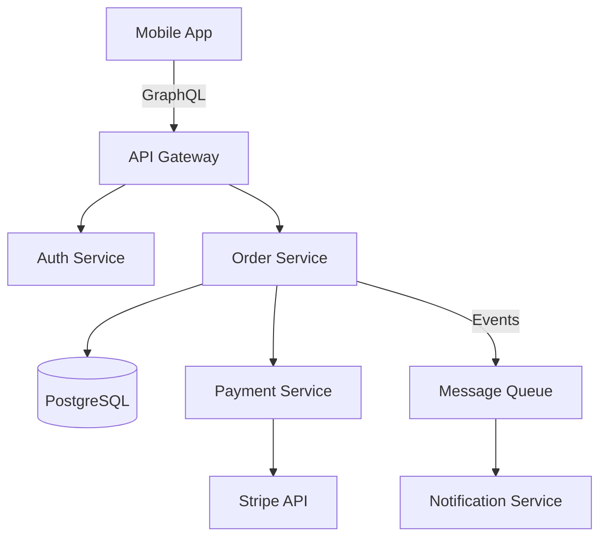

# Use Case: Generating Stakeholder Documents

From meeting input to professional deliverables — how Execution-OS turns requirements into Gantt charts, system flows, proposal decks, and executive briefs.

---

## The Pipeline

```
Meeting Input → Intake → Analyze → Render → Review → Handoff to Dev
     |
     ├── PDF requirement doc
     ├── Meeting transcript
     ├── Word document / PPTX
     ├── Whiteboard photo
     ├── Excel data
     └── Verbal description
```

Lelouch handles the entire pipeline using the `stakeholder-docs` skill. Wantan routes automatically when you mention "timeline", "Gantt", "roadmap", "system flow", "proposal deck", or "executive brief".

---

## Scenario 1: PDF Requirement → Gantt Chart + Proposal Deck

A stakeholder sends you a PDF with project requirements. You need a timeline and a deck for the next meeting.

### Step 1: Feed the PDF

```
Here's the requirement doc from the client: /path/to/requirements.pdf
I need a Gantt chart and proposal deck for the CTO meeting on Friday
```

Lelouch reads the PDF directly (Claude's Read tool handles PDFs natively, up to 20 pages per request), extracts requirements, and asks clarifying questions:

> "I've read the requirement doc. I see 4 major features: user auth, dashboard, reporting, and notification system. A few questions before I build the timeline:
> - Any fixed launch date?
> - Which features are P0 vs P1?
> - How many developers are available?"

### Step 2: Confirm the Breakdown

After you answer, Lelouch presents the structured breakdown:

```markdown
## Project Breakdown: Client Portal v2

### Epics
1. User Authentication — 8d
   - SSO integration: 5d
   - Role-based access: 3d — depends on SSO
2. Dashboard — 12d
   - Data aggregation API: 5d
   - Chart components: 4d
   - Real-time updates: 3d — depends on API
3. Reporting — 8d
   - Report builder: 5d
   - PDF export: 3d
4. Notifications — 5d
   - Email service: 3d
   - In-app notifications: 2d

### Milestones
| Milestone          | Target     | Risk   |
|--------------------|------------|--------|
| Auth complete      | Week 2     | Low    |
| Dashboard MVP      | Week 4     | Medium |
| Full feature set   | Week 6     | Medium |
| Production launch  | Week 8     | Low    |
```

You confirm: "looks good, proceed"

### Step 3: Get the Documents

Lelouch renders:

- `vault/02-docs/stakeholder/client-portal-v2/gantt.mmd` + `gantt.png` — Mermaid Gantt chart
- `vault/02-docs/stakeholder/client-portal-v2/deck.pptx` — Proposal deck with embedded Gantt and system flow
- `vault/02-docs/stakeholder/client-portal-v2/flow.mmd` + `flow.png` — System architecture diagram

All ready for the CTO meeting.

---

## Scenario 2: Meeting Transcript → Full Document Suite

You just finished a stakeholder meeting and have a transcript.

### Step 1: Feed the Transcript

```
Here's the transcript from today's planning meeting: /path/to/meeting-transcript.txt

Generate:
1. Gantt chart with the timeline we discussed
2. System flow for the new payment integration
3. Executive brief for the VP
4. Project plan spreadsheet
```

Lelouch reads the transcript, extracts decisions, requirements, timelines, and action items, then generates all four documents.

---

## Scenario 3: Whiteboard Photo → System Flow Diagram

You took a photo of the whiteboard after an architecture discussion.

### Step 1: Feed the Image

```
Here's the whiteboard sketch from our architecture session: /path/to/whiteboard.jpg
Turn this into a proper system flow diagram
```

Claude reads the image natively — sees boxes, arrows, labels, and notes. Lelouch converts the sketch into a clean Mermaid flowchart:



Rendered to PNG and ready for the stakeholder deck.

---

## Scenario 4: Word Document → Requirements Analysis + Timeline

A business analyst shares a Word doc with functional requirements.

### Step 1: Feed the DOCX

```
Analyze this requirements doc and create a project timeline: /path/to/functional-requirements.docx
```

Lelouch extracts text via `markitdown`, parses the requirements into epics and features, estimates effort, identifies dependencies, and generates a Gantt chart.

---

## Scenario 5: Multiple Inputs → Cross-Referenced Analysis

You have several artifacts from a stakeholder engagement:

```
Here are the inputs from the discovery phase:
1. /path/to/requirements.pdf — the signed-off requirements
2. /path/to/meeting-notes.txt — transcript from the kickoff
3. /path/to/whiteboard.jpg — architecture sketch
4. /path/to/budget.xlsx — approved budget and resource allocation

Generate a complete stakeholder package: Gantt, system flow, sequence diagram, executive brief, and proposal deck.
```

Lelouch reads ALL files, cross-references information (requirements from the PDF, timeline constraints from the transcript, architecture from the whiteboard, budget from the spreadsheet), and generates a consistent set of documents.

---

## Scenario 6: Roadmap for Product Planning

You need a quarterly roadmap for the board meeting.

```
Create a product roadmap for 2025. Here are the themes:
- Q1: Foundation (auth, core API, admin)
- Q2: Growth (onboarding, payments, analytics)
- Q3: Scale (performance, mobile app, API v2)
- Q4: Enterprise (SSO, audit logging, compliance)
```

Lelouch generates a Mermaid Gantt chart with quarterly sections and a proposal deck with roadmap slides.

---

## Scenario 7: Iterative Refinement

First round isn't perfect? Iterate.

```
The Gantt chart looks good but:
- Move the mobile app to Q2 instead of Q3
- Add a milestone for "beta launch" at the end of Q2
- The system flow is missing the caching layer
```

Lelouch updates the Mermaid source files, re-renders, and updates any affected documents (deck, brief, spreadsheet) to stay in sync.

---

## Supported Input Formats

| Format | How It's Processed |
|--------|-------------------|
| **PDF** (.pdf) | Read tool — Claude reads PDFs natively (up to 20 pages per request, chunked for large docs) |
| **Word** (.docx) | `markitdown` or `pandoc` extracts text to Markdown |
| **PowerPoint** (.pptx) | `markitdown` extracts slide content |
| **Images** (.jpg, .png) | Read tool — Claude sees images natively (whiteboard photos, screenshots, sketches) |
| **Text** (.txt, .md) | Read tool — direct text processing |
| **Excel/CSV** (.xlsx, .csv) | pandas reads structured data |
| **Verbal** | Lelouch asks clarifying questions via the Intake Checklist |

---

## Supported Output Formats

| Document | Format | Renderer |
|----------|--------|----------|
| Gantt chart | PNG, SVG, PDF | Mermaid + `mmdc` |
| System flow | PNG, SVG, PDF | Mermaid flowchart |
| Sequence diagram | PNG, SVG, PDF | Mermaid sequenceDiagram |
| Architecture diagram | PNG, SVG, PDF | Mermaid C4Context |
| ER diagram | PNG, SVG, PDF | Mermaid erDiagram |
| Mindmap | PNG, SVG, PDF | Mermaid mindmap |
| Roadmap | PNG, SVG, PDF | Mermaid Gantt (quarterly sections) |
| Interactive timeline | HTML | Plotly px.timeline |
| Executive brief | DOCX | docx skill |
| Proposal deck | PPTX | pptx skill |
| Project plan | XLSX | xlsx skill |

---

## Handoff to Development

Once stakeholder documents are finalized:

```
The CTO approved the project plan. Let's start development.
```

Wantan routes to Lelouch to convert the approved breakdown into a formal spec (SDD Phase 1), which then flows through the full pipeline:

```
Approved stakeholder docs
    → Lelouch writes dev spec (Phase 1)
    → Byakuya validates (Phase 1.5)
    → Parallel wave: Rohan + Killua + Conan + L (Phase 2)
    → Implementation + testing (Phase 3)
    → Review + security (Phase 4)
    → Deploy (Phase 5)
```

The Gantt chart becomes Kazuma's sprint plan. System flows become Senku's architecture reference. Everything connects.

---

## Tips

1. **Feed all your files at once.** Lelouch cross-references multiple inputs for better analysis. Don't drip-feed.

2. **Be specific about the audience.** "Deck for the CTO" produces different content than "deck for the engineering team."

3. **Confirm the breakdown before rendering.** The Phase 2 gate exists to catch scope misunderstandings early — before you've wasted rendering time.

4. **Keep the .mmd source files.** Mermaid files are plain text and easy to version control, diff, and edit later.

5. **Install mmdc for best results.** `npm install -g @mermaid-js/mermaid-cli` — without it, you get raw Mermaid code blocks (still renderable on GitHub/GitLab/Notion, but no standalone PNG/SVG).

6. **Large PDFs? Chunk them.** For PDFs over 20 pages, Lelouch reads in 10-20 page chunks and synthesizes. Mention the most important pages if you know them.
