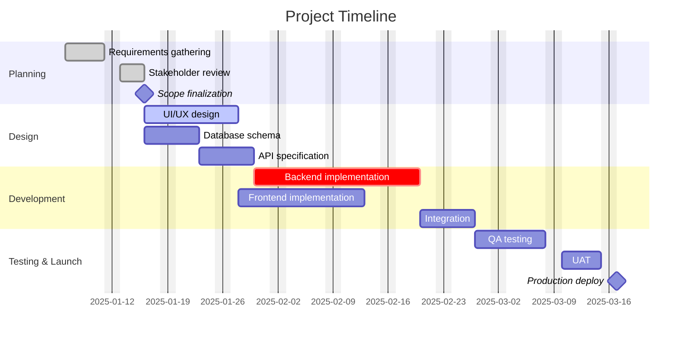
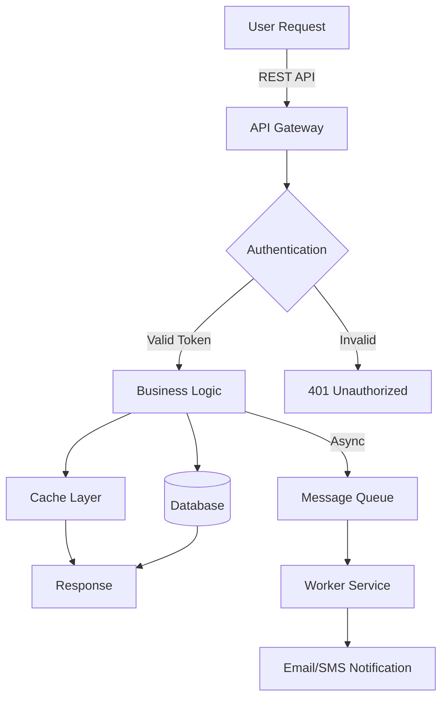
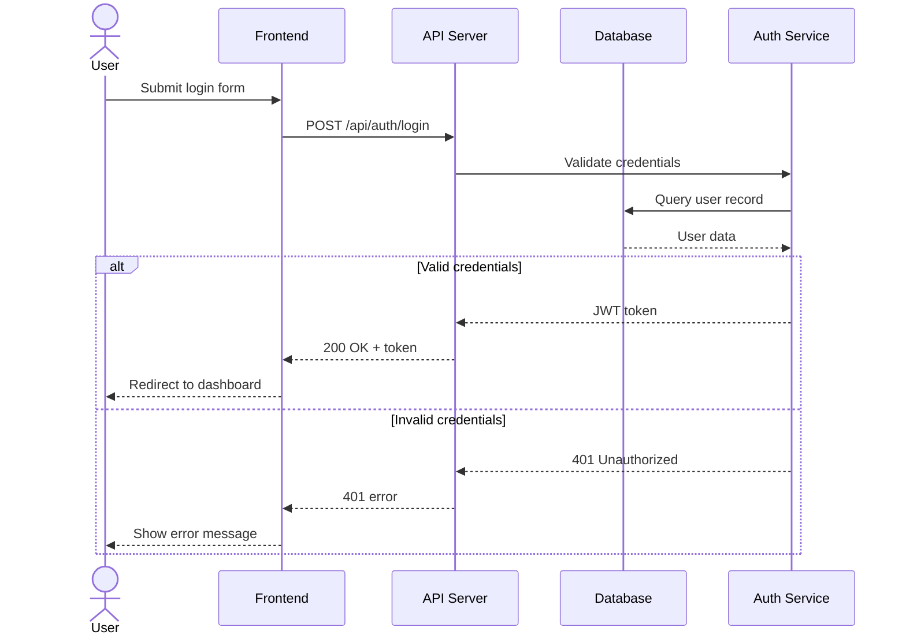
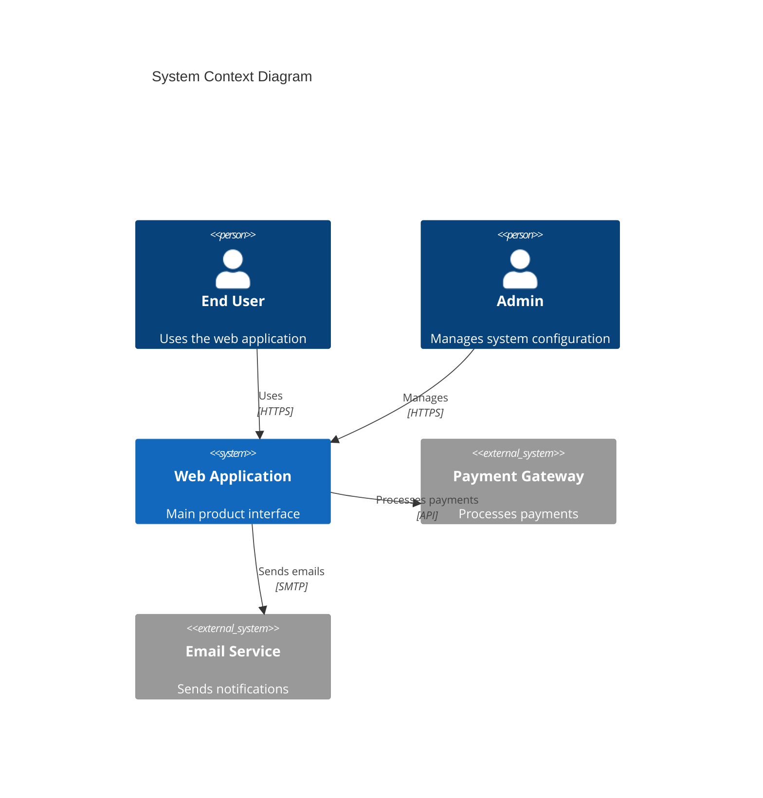
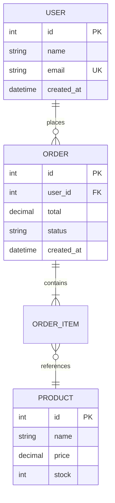
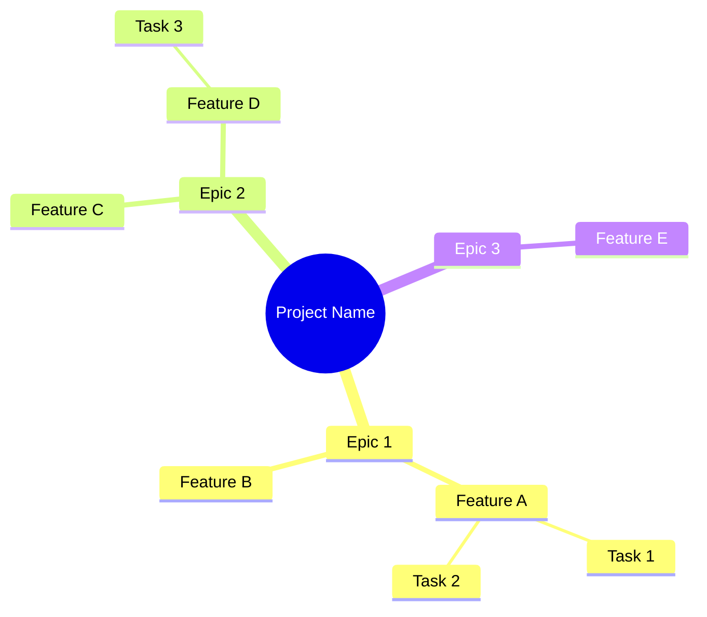
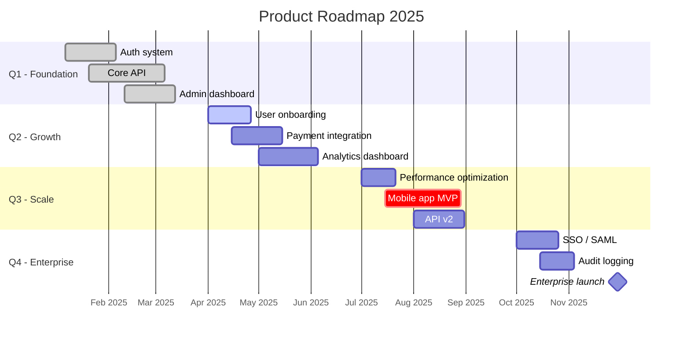

# Stakeholder Docs

Generate professional stakeholder-facing documents from requirements, meeting notes, or analysis results. Combines Mermaid diagrams, Plotly timelines, and existing office document skills (pptx, docx, xlsx) into a single pipeline.

## Supported Document Types

| Type | Renderer | Output Formats | Best For |
|------|----------|----------------|----------|
| Gantt Chart | Mermaid | PNG, SVG, PDF | Project schedules, sprint plans, delivery timelines |
| System Flow | Mermaid `flowchart` | PNG, SVG, PDF | Process flows, decision trees, data pipelines |
| Sequence Diagram | Mermaid `sequenceDiagram` | PNG, SVG, PDF | API interactions, auth flows, service calls |
| Architecture Diagram | Mermaid `C4Context` | PNG, SVG, PDF | System context for non-technical stakeholders |
| ER Diagram | Mermaid `erDiagram` | PNG, SVG, PDF | Database schema, data models |
| Mindmap | Mermaid `mindmap` | PNG, SVG, PDF | Feature breakdown, requirement decomposition |
| Roadmap | Mermaid Gantt (quarterly sections) | PNG, SVG, PDF | Product roadmap by quarter/theme |
| Interactive Timeline | Plotly `px.timeline` | Self-contained HTML | Executive dashboards, interactive project views |
| HTML Slide Deck | html-slides skill (Megumin) | Self-contained HTML | Browser-based presentations, shareable decks |
| Executive Brief | docx skill | DOCX | Formal stakeholder handoff documents |
| Proposal Deck | pptx skill | PPTX | Stakeholder presentations, pitch decks |
| Project Plan | xlsx skill | XLSX | Detailed task lists with estimates, resource allocation |

## Dependencies

```bash
# Mermaid CLI — renders .mmd files to PNG/SVG/PDF
npm install -g @mermaid-js/mermaid-cli

# Plotly — interactive timelines (optional, only for HTML output)
pip install plotly pandas kaleido
```

If `mmdc` is not installed, fall back to embedding raw Mermaid code blocks in Markdown (renderable on GitHub, Notion, GitLab).

---

## Workflow

### Phase 1: INTAKE

Capture and structure the input. Accept any of these:

| Input Type | How to Process |
|------------|----------------|
| **PDF** (.pdf) | Read directly with the Read tool (up to 20 pages per request — use `pages` parameter for large PDFs). Extract requirements, decisions, action items. |
| **Word document** (.docx) | Extract text: `python -m markitdown document.docx` or `pandoc document.docx -o output.md`. Read the output and parse. |
| **PowerPoint** (.pptx) | Extract text: `python -m markitdown presentation.pptx`. Read slide content for requirements/context. |
| **Images** (whiteboard photos, screenshots, sketches) | Read directly with the Read tool — Claude sees images natively. Extract text, diagrams, flowcharts, or notes from the image. |
| **Meeting transcript** (text, .txt) | Read the file. Extract action items, decisions, requirements, stakeholders. |
| **Excel / CSV** | Read with pandas: `pd.read_excel('file.xlsx')` or `pd.read_csv('file.csv')`. Parse structured data. |
| **Verbal description** | Ask clarifying questions (see Intake Checklist below). |
| **Existing spec** (Lelouch output) | Extract scope, acceptance criteria, dependencies. |
| **Raw idea** | Expand into structured requirements. |

#### File Processing Notes

- **Multiple files**: If the user provides several files (e.g., PDF requirement + whiteboard photo + transcript), read ALL of them before proceeding. Cross-reference information across files.
- **Large PDFs**: Use `pages` parameter — read in chunks (e.g., `pages: "1-10"`, then `pages: "11-20"`). Summarize each chunk, then synthesize.
- **Handwritten notes / whiteboard**: The Read tool handles images — describe what you see (text, diagrams, arrows, boxes) and convert to structured requirements.
- **DOCX/PPTX dependencies**: `pip install "markitdown[pptx]"` for markitdown. Pandoc is an alternative for DOCX.

#### Intake Checklist

Before proceeding to Phase 2, ensure you have answers to:

- [ ] **What** — What is being built? (feature list or epic breakdown)
- [ ] **Who** — Who are the stakeholders? Who is the audience for these documents?
- [ ] **When** — Any fixed deadlines, milestones, or launch dates?
- [ ] **How big** — Rough scope (S/M/L/XL) for timeline estimation
- [ ] **Dependencies** — External teams, APIs, approvals blocking work?
- [ ] **Risks** — Known technical risks, compliance requirements, unknowns?
- [ ] **Output format** — Which documents does the stakeholder need? (Gantt, deck, brief, flow diagram, all?)

If the user provides incomplete input, ask the missing questions. Do NOT guess timeline estimates without explicit input.

### Phase 2: ANALYZE

Break requirements into a structured project breakdown:

```markdown
## Project Breakdown: {project name}

### Epics
1. {Epic 1} — {description}
   - Feature 1.1: {name} — Est: {days}d — Depends on: {none/feature}
   - Feature 1.2: {name} — Est: {days}d — Depends on: {feature}
2. {Epic 2} — {description}
   - Feature 2.1 ...

### Milestones
| Milestone | Target Date | Depends On | Risk Level |
|-----------|-------------|------------|------------|
| {name}    | YYYY-MM-DD  | {features} | Low/Med/High |

### Risks
| Risk | Impact | Likelihood | Mitigation |
|------|--------|------------|------------|
| {risk} | High/Med/Low | High/Med/Low | {action} |

### Resource Allocation
| Phase | Agents/Team | Duration |
|-------|-------------|----------|
| {phase} | {who} | {days}d |
```

Present the breakdown to the user. Get confirmation before rendering documents.

**GATE: User confirms breakdown before proceeding to Phase 3.**

### Phase 3: RENDER

Generate the requested documents. Render each in order of dependency:
1. Diagrams first (Gantt, flows, architecture) — these get embedded in decks/briefs
2. Interactive timeline (if requested)
3. HTML slide deck (if requested) — delegate to Megumin via html-slides skill
4. Office documents (deck, brief, spreadsheet) — embed diagrams from step 1

Output location: all deliverables go into the vault under `02-docs/stakeholder/`.

```bash
mkdir -p vault/02-docs/stakeholder/{project-slug}
```

All files go into `vault/02-docs/stakeholder/{project-slug}/`:
- `gantt.mmd` + `gantt.png` — Gantt chart source and render
- `flow.mmd` + `flow.png` — System flow source and render
- `sequence.mmd` + `sequence.png` — Sequence diagram source and render
- `timeline.html` — Interactive Plotly timeline
- `slides.md` + `slides.html` — Slide source + HTML render (Megumin via html-slides skill)
- `brief.docx` — Executive brief
- `deck.pptx` — Proposal deck
- `plan.xlsx` — Project plan spreadsheet

### Phase 4: REVIEW

Present all generated documents to the user:

1. Show diagram previews (read the rendered PNG files)
2. Summarize the deck/brief/spreadsheet contents
3. Ask for feedback: "Any changes needed before finalizing?"

If changes requested:
- Modify the source (`.mmd` file, Python script, etc.)
- Re-render affected outputs
- Re-present for review

Iterate until user approves.

**GATE: User approves final documents.**

### Phase 5: HANDOFF (Optional)

When the stakeholder discussion is finalized and the project is ready for development:

1. Convert the approved breakdown into a dev-ready spec (route to Lelouch for formal spec creation)
2. The Gantt chart becomes the sprint plan (route to Kazuma)
3. System flows become architecture reference (route to Senku for ADR if needed)

---

## Mermaid Syntax Reference

### Gantt Chart



**Task modifiers:**
- `done` — completed task (grey)
- `active` — in-progress task (blue)
- `crit` — critical path (red)
- `milestone` — diamond marker, use `0d` duration
- `after taskId` — dependency

**Sections** group tasks visually. Use for: phases, teams, epics, quarters.

### Flowchart (System Flow)



**Node shapes:**
- `[text]` — rectangle (process)
- `{text}` — diamond (decision)
- `[(text)]` — cylinder (database)
- `([text])` — stadium (terminal)
- `((text))` — circle
- `>text]` — flag
- `[/text/]` — parallelogram (I/O)

**Arrow styles:**
- `-->` — solid arrow
- `-.->` — dotted arrow
- `==>` — thick arrow
- `-->|label|` — labeled arrow

**Direction:** `TD` (top-down), `LR` (left-right), `BT` (bottom-top), `RL` (right-left)

### Sequence Diagram



**Arrow types:**
- `->>` — solid with arrowhead (request)
- `-->>` — dashed with arrowhead (response)
- `-x` — solid with cross (async/fire-and-forget)

**Blocks:** `alt/else/end`, `opt/end`, `loop/end`, `par/and/end`, `critical/end`

### C4 Architecture Diagram



Use C4 for high-level system context — what stakeholders understand best.

### ER Diagram



**Relationship types:**
- `||--||` — one to one
- `||--o{` — one to many
- `}o--o{` — many to many
- `||--|{` — one to one or more

### Mindmap (Requirement Breakdown)



Use mindmaps for requirement decomposition during stakeholder workshops.

### Roadmap (Quarterly)

Use Gantt chart with quarterly sections:



---

## Rendering Commands

### Mermaid to Image

```bash
# PNG (default, best for embedding in docs/decks)
mmdc -i diagram.mmd -o diagram.png -t default -b white -w 1600

# SVG (scalable, best for web/print)
mmdc -i diagram.mmd -o diagram.svg -t default -b white

# PDF (best for formal documents)
mmdc -i diagram.mmd -o diagram.pdf -t default -b white

# Dark theme (for dark-themed presentations)
mmdc -i diagram.mmd -o diagram.png -t dark -b transparent
```

**Theme options:** `default`, `dark`, `forest`, `neutral`

If `mmdc` is not available, output the `.mmd` file with instructions:
> "Install with `npm install -g @mermaid-js/mermaid-cli`, then run `mmdc -i {file}.mmd -o {file}.png`"

Also note: Mermaid code blocks render natively on GitHub, GitLab, Notion, and Obsidian.

### Plotly Interactive Timeline

```python
import plotly.express as px
import pandas as pd

df = pd.DataFrame([
    dict(Task="Requirements", Start="2025-01-06", Finish="2025-01-17", Phase="Planning"),
    dict(Task="Design", Start="2025-01-20", Finish="2025-02-07", Phase="Design"),
    dict(Task="Backend Dev", Start="2025-02-10", Finish="2025-03-14", Phase="Development"),
    dict(Task="Frontend Dev", Start="2025-02-17", Finish="2025-03-14", Phase="Development"),
    dict(Task="Testing", Start="2025-03-17", Finish="2025-03-28", Phase="QA"),
    dict(Task="Launch", Start="2025-03-31", Finish="2025-04-04", Phase="Launch"),
])

fig = px.timeline(
    df, x_start="Start", x_end="Finish", y="Task", color="Phase",
    title="Project Timeline",
    color_discrete_sequence=px.colors.qualitative.Set2
)
fig.update_yaxes(autorange="reversed")
fig.update_layout(
    font=dict(family="Inter, sans-serif", size=14),
    plot_bgcolor="white",
    height=400
)
fig.write_html("timeline.html", include_plotlyjs=True)
```

The HTML file is self-contained (~3MB) and opens in any browser. Use `include_plotlyjs='cdn'` for smaller file size (requires internet).

---

## Output Templates

### Executive Brief Structure (for docx skill)

```markdown
# Executive Brief: {Project Name}

**Date:** YYYY-MM-DD
**Prepared for:** {Stakeholder name/group}
**Prepared by:** {Team/Author}

## Executive Summary
{2-3 sentences: what we're building, why, and when it ships}

## Objectives
1. {Primary objective}
2. {Secondary objective}
3. {Tertiary objective}

## Scope
**In scope:**
- {item}

**Out of scope:**
- {item}

## Timeline Overview
{Embed Gantt chart image}

## Key Milestones
| Milestone | Date | Owner |
|-----------|------|-------|
| {milestone} | YYYY-MM-DD | {who} |

## System Overview
{Embed system flow diagram}

## Risk Assessment
| Risk | Impact | Likelihood | Mitigation |
|------|--------|------------|------------|
| {risk} | H/M/L | H/M/L | {action} |

## Resource Requirements
| Role | Count | Duration |
|------|-------|----------|
| {role} | {n} | {weeks}w |

## Budget Estimate
{If applicable}

## Next Steps
1. {Action item} — Owner: {who} — By: {date}
2. {Action item} — Owner: {who} — By: {date}

## Appendix
- {Link to detailed project plan}
- {Link to technical spec}
```

### Proposal Deck Structure (for pptx skill)

| Slide | Content |
|-------|---------|
| 1. Cover | Project name, date, stakeholder name |
| 2. Problem | What problem are we solving? (1-2 key points) |
| 3. Solution | What we propose to build (feature highlights) |
| 4. System Overview | Embed system flow or architecture diagram |
| 5. Timeline | Embed Gantt chart |
| 6. Milestones | Key milestones table |
| 7. Risks & Mitigations | Risk matrix |
| 8. Resources & Budget | Team and cost estimates |
| 9. Next Steps | Action items with owners and dates |
| 10. Q&A | Contact info, links to detailed docs |

### Project Plan Structure (for xlsx skill)

| Sheet | Columns |
|-------|---------|
| **Tasks** | ID, Epic, Feature, Task, Owner, Start Date, End Date, Duration (days), Status, Dependencies, Notes |
| **Milestones** | Milestone, Target Date, Status, Linked Tasks |
| **Risks** | ID, Risk, Impact, Likelihood, Score (Impact x Likelihood), Mitigation, Owner, Status |
| **Resources** | Role, Name, Allocation %, Start, End, Cost Rate |

---

## Constraints

- NEVER guess timelines — ask the user for estimates or use their input as basis
- NEVER fabricate milestone dates — derive from task durations and dependencies
- NEVER skip the user confirmation gate between Phase 2 (Analyze) and Phase 3 (Render)
- ALWAYS present the project breakdown before generating documents
- ALWAYS embed actual diagrams in decks/briefs — never placeholder text like "[insert Gantt here]"
- ALWAYS output Mermaid source files (`.mmd`) alongside rendered images — stakeholders may want to edit later
- ALWAYS use `excludes weekends` in Gantt charts unless the user specifies otherwise
- When dates are not provided, use relative durations (`5d`, `after taskId`) not hardcoded dates
- When scope changes during review (Phase 4), update ALL affected documents — Gantt, deck, brief, and spreadsheet must stay in sync
- For decks and briefs, follow the pptx and docx skill guidelines respectively (typography, spacing, color palette rules)

## Checklist

Before declaring documents complete:

- [ ] All requested document types have been generated
- [ ] Gantt chart includes all epics and milestones from the breakdown
- [ ] System flow covers all major components mentioned in requirements
- [ ] Dates are consistent across Gantt, deck, brief, and spreadsheet
- [ ] Mermaid source files (`.mmd`) saved alongside rendered outputs
- [ ] No placeholder text in any document
- [ ] User has reviewed and approved the output
- [ ] Output directory is organized: `vault/02-docs/stakeholder/{project-slug}/`

## Related Skills

| Skill | Relationship |
|-------|-------------|
| `spec-driven-dev` | Phase 5 handoff — approved requirements become Lelouch specs |
| `html-slides` | Used in Phase 3 for HTML slide deck generation (Megumin) |
| `pptx` | Used in Phase 3 for proposal deck generation |
| `docx` | Used in Phase 3 for executive brief generation |
| `xlsx` | Used in Phase 3 for project plan spreadsheet |
| `sprint-ceremonies` | Phase 5 handoff — Gantt becomes Kazuma's sprint plan |
| `adr-writer` | Phase 5 handoff — architecture diagrams become Senku's ADR input |
| `session-plan` | Can be used to plan stakeholder workshop sessions |
